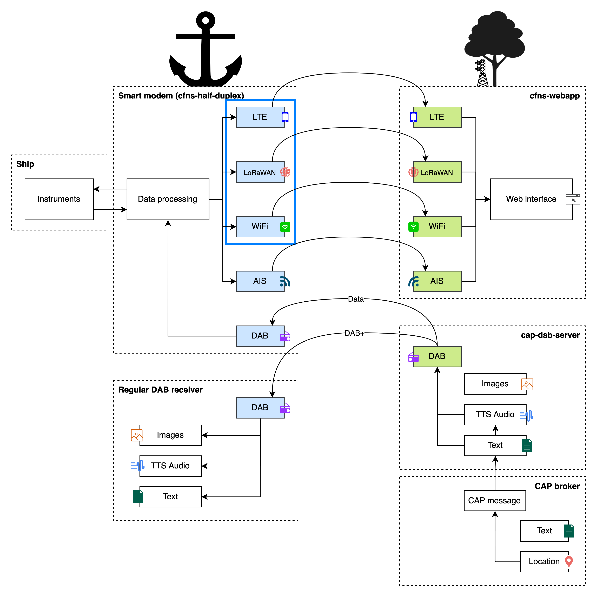

# cfns-hd-fipy

This application interfaces with
[cfns-half-duplex](https://github.com/PoCDAB/cfns-half-duplex). See the diagram
below.



## Requirements

### Software
- VSCode with the extension pymakr or Atom or some application which lets you upload code to the Pycom FiPy.

### Hardware 
- Pycom FiPy (model: FiPy 1.0)

## Setups

### Setup VSCode + Pymakr
1. Download vscode [here](https://code.visualstudio.com/download).
2. Install vscode.
3. Open vscode by clicking the Windows button and type VSCode or open a Command Prompt and type (for Windows):
````text
code .
````
4. Go the the extensions tab and search for pymakr.
5. Click install.
6. You have succesfully setup pymakr with visual studio code.

If you want to setup multiple technologies you need to follow the setup until it tells you to upload the code. Then you need to swith to the other technology you want to setup. If you have setup all the technologies you can upload the code once.

### Setup WiFi 
1. Make sure you know how to upload code to the Pycom FiPy. If you don't know you can follow [Setup VSCode + Pymakr](### Setup-VSCode-+-Pymakr).
2. Make sure you can connect to the WiFi network that the Raspberry Pi uses.
3. Open [Wifi.py](Wifi.py).
4. In the WiFi class change the _ssid_ and _pswd_ to the ssid and pswd of the same network the Raspberry Pi uses.
5. Choose a _static_address_ for the FiPy to use within the network. Make sure the _static_address_ is a valid not used ip_address in the network.
6. Save [Wifi.py](Wifi.py).
7. Upload the code to the FiPy. For Windows using VSCode + Pymakr press F1 and then Pymakr> Upload Project.
8. You have successfully setup WiFi for the Pycom FiPy. If the device won't upload see [Won't upload](### Won't-upload).

### Setup LoRaWAN
1. To setup LoRaWAN and the FiPy for the first time see [this link](https://pycom.io/wp-content/uploads/2020/04/Lesson-4-Getting-Connected-with-LoRa.pdf).
2. If it is succesful you know that everything should be able to work. If it is not succesful it can either mean something went wrong or you have no reach. If it's the latter there is nothing you can do except for going closer to a gateway until it does succeed.
3. Open [LoraWAN.py](LoraWAN.py).
4. Replace the placeholders in the method initLoRa with the data of the TTN app you made in step 1.
5. Save [LoraWAN.py](LoraWAN.py).
7. Upload the code to the FiPy. For Windows using VSCode + Pymakr press F1 and then Pymakr> Upload Project.
8. You have successfully setup LoRaWAN for the Pycom FiPy. If the device won't upload see [Won't upload](### Won't-upload).

### Setup LTE (CAT-M1)
1. Open [LTE.py](LTE.py).
2. Fill in the phonenumber of the phone you want to send the SMS to.
3. Save [LTE.py](LTE.py).
4. Upload the code to the FiPy. For Windows using VSCode + Pymakr press F1 and then Pymakr> Upload Project.
5. You have successfully setup LTE for the Pycom FiPy. If the device won't upload see [Won't upload](### Won't-upload).

## Common problems

### Won't upload
If the code won't upload and displays the error that you need to reboot the device manually. Then you need to do the following:
1. Press the reset button on the Pycom FiPy.
2. Keep pressing Ctrl+C (for Windows) to Keyboardinterrupt until you see the following:
````text
>>>
````
3. Then you can upload the code again by pressing F1 and then Pymakr> Upload Project (for Windows).
